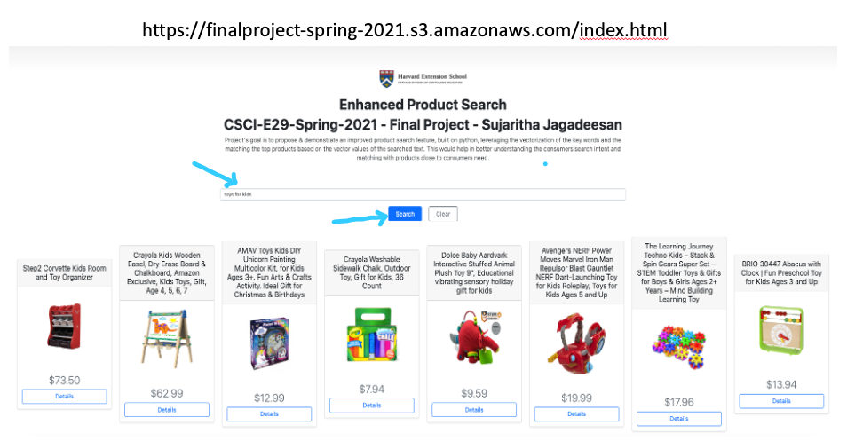

.. _intro:

Project Introduction
=====================

Final Project: Enhanced Product Search (CSCI E-29 - Spring 2021)

Submitted by: Sujaritha Jagadeesan

.. _demo:

Try Enhanced Product Search Demo - Click Here
---------------------------------------------

**Click** the below link to test the **'Enhanced Product Search'**

        `<https://finalproject-spring-2021.s3.amazonaws.com/index.html?>`_

As shown in the below screenshot, please enter the *search text* and press **"Search"** button.
It may take few seconds to display the results.

.. _goal:

Project Goal
------------

To propose and demonstrate an 'Enhanced product search', built on python, leveraging 'Word Embedding' and 'word2vec'.
By vectorizing the product description and the search text, we find the cosine similarity and the distance between them
to return the top matching products.
This would help in better understanding the consumer's search intent and retrieve products close to consumer's need.

.. _video:

Project Video
--------------

Click the below video to know about the **"Enhanced Product Search"** project.

.. raw:: html

   <iframe width="560" height="315" src="https://www.youtube.com/embed/7grRAQ1tLsE" title="YouTube video player" frameborder="0" allow="accelerometer; autoplay; clipboard-write; encrypted-media; gyroscope; picture-in-picture" allowfullscreen></iframe>