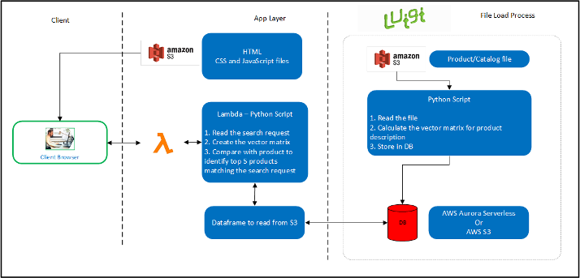

.. _architecture:

Architecture and Pipeline:
==========================

.. _pipeline:

Pipeline Architecture
----------------------

.. _overview:

Components and Technologies
---------------------------

.. _applayer:

Application Layer
++++++++++++++++++
    **Web page to search the products**:

    Created using basic HTML,CSS,Javascript. The WebPage is hosted in *S3*.

    **API Gateway**:

    JQuery is used to make the API call and display the returned products.

    **AWS Lambda**:

    Python script uses 'Word Embedding' and 'Word2vec' to vectorize the search text,
    find cosine similarity and distance between the searched text and vectorized product description
    that are stored in S3 by the file load process.

.. _fileload:

File Load Process
+++++++++++++++++++

    **Kaggle Dataset**:

    'Amazon product' dataset from Kaggle is used as the dataset for the project.

    **Source S3**:

    The Kaggle's Amazon product dataset is uploaded to source path of S3.

    **Luigi**:

    Luigi is used for task and workflow control. It reads the data into Dask frame, calculates the vector
    for the product description and adds it as a new column to the dataset.

    **Dask**:

    The input file is split into multiple files for easy handling and Dask dataframe is used to handle
    multiple input files.

    **Target S3**:

    The input gets processed and a new column with vector values of 'Product Description' and the
    output is stored in the S3 as well.

