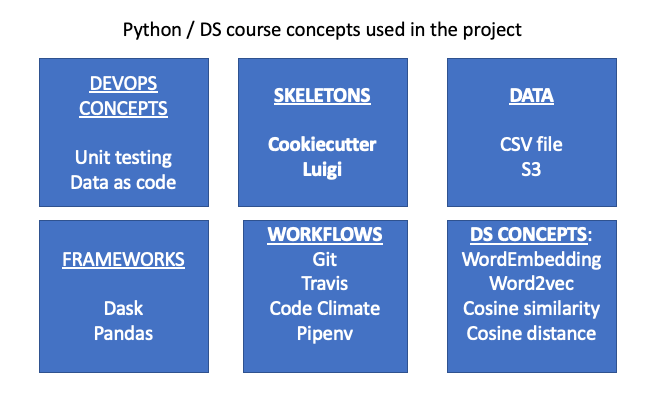
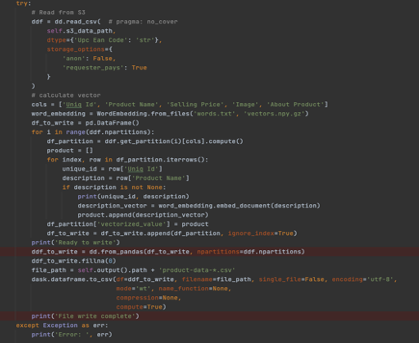
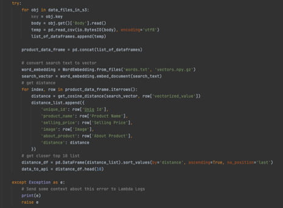

.. _highlights:

Highlights
===========

.. _concepts:

Advanced Python concepts Applied
---------------------------------

   * Frameworks - Dask, Pandas
   * Skeletons - Cookiecutter, Luigi
   * Workflows - Git, Travis, Pipenv, Testing
   * Data - csv file, S3
   * WordEmbedding, word2vec

.. _new:

New learnings
-------------
    * Creating Web page using HTML, CSS and Javascript
    * Embed JQuery to HTML make API calls
    * To configure and trigger Lambda
    * Deploying Lambda locally using SAM
    * Deploying Lambda in S3 using Travis

.. _enhancements:

Future Enhancements
--------------------
    * Store the Target file in Aurora serverless instead of S3
    * Improve performance of Lambda and hence improve the time taken to retrieve products no search.
    * Implement a conversational search model based on history of searched text.

.. _code:

Code Snippets
--------------
For this project, the full code is shared. So just providing a snippet of code for reference here.

1) Code Snippet of Luigi workflow

2) Code Snippet of lambda to calculate distance

