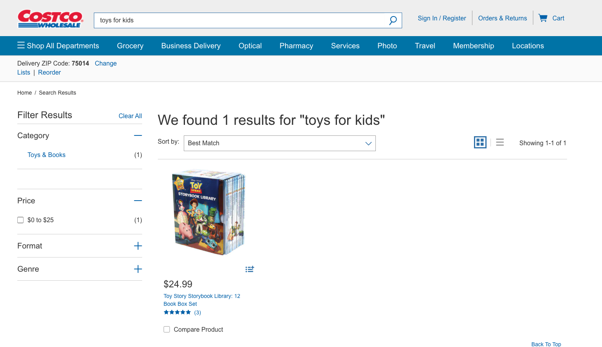

.. _background:

Background and Motivation
==========================

In our day-to-day life, we search for products online all the time.Especially during these COVID times,
we rely on online searching and shopping a lot more.

When we shop online, we search for products in retailer's websites.
Typically, many retailer websites use 'search' based on keywords and tagging.

.. _drawbacks:

Drawbacks of keywords based search
----------------------------------
There are some serious drawbacks to 'keywords' based search.
The first and foremost, it fails to retrieve related products if the 'search text' doesn't exactly match the keywords
tagged for that product.

For example, when we enter a 'single' word in the 'search box', the search would return all the relevant products.
But, when we enter *more than one word* in the search box, the 'search' may not retrieve all the products as expected.
This is simply because the 'search text' did not match the exact keywords that were tagged for the products.

Keywords based search drawback is shown in the below screenshots:

1) Screenshot of 'keyword' search **working as expected** with 1 word in the search text.

2) Screenshot of 'keyword' search **not working as expected** when provided with more than 1 word in the search text.

.. _alternate:

Alternate-Enhanced Product search
----------------------------------
As an alternate to the above drawback, I wanted to leverage 'Word Embedding' and 'word2vec' to search and retrieve
products that are more aligned with the customer search text.
So, for the final project, I explored and implemented 'Enhanced product search' based on 'Word Embedding' and 'word2vec'.

.. _focus:

Focus on workflow not on Datascience
------------------------------------
The focus of this final project is more on *leveraging the advanced python concepts* learned in class and on *new
technologies and integrations* explored to built a robust workflow for 'Enhanced product search'. This project is less
focused on the datascience side. In future, the plan is to improve the search and build a 'conversational search',
based on the history of items searched by the user before. But for the final project, the focus is more on workflow side
of things and not on datascience side of things.

